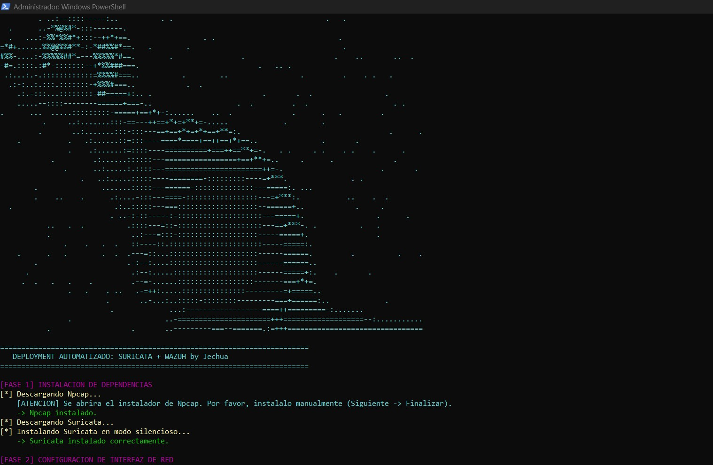

# Integración Suricata-Wazuh (Windows)

**Integración Suricata-Wazuh** es un script  en PowerShell que automatiza por completo la instalación, configuración e integración de un sensor de red Suricata con un agente de Wazuh en endpoints de Windows. Está diseñado para facilitar el despliegue a escala en enpoints con sistema operativo Windows.

> ATENCION: Este script modifica la configuración de red y las tareas programadas del sistema.

---

## Caracteristicas

* Descarga e instalación automática de dependencias (Suricata y Npcap, últimas versiones).
* Detección interactiva de adaptadores de red y extracción automática del UUID.
* Descarga de reglas actualizadas (Emerging Threats).
* Edición automática y segura de archivos de configuración:
  * Modificación de `C:\Program Files\Suricata\Suricata.yaml` mediante Expresiones Regulares (Regex) para definir variables de red y reglas.
  * Inyección nativa de nodos XML en `C:\Program Files (x86)\ossec-agent\ossec.conf` para el reenvío de logs (eve.json) hacia el SIEM.
* Configuración de persistencia nativa creando una Tarea Programada ejecutada con privilegios máximos (NT AUTHORITY\SYSTEM).
* Reinicio automático de servicios utilizando cmdlets nativos de PowerShell.

---

## Captura de Pantalla


---

## Requisitos Previos

* Sistema operativo Windows (Probado en Windows 10/11 y Windows Server).
* PowerShell 5.1 o superior.
* Wazuh Agent previamente instalado en el sistema.
* Privilegios de Administrador local.

---

## Instalacion y Uso

1. Clona el repositorio en el equipo Windows objetivo:

    ```powershell
    git clone [https://github.com/jechua712/Suricata-Wazuh-Windows.git](https://github.com/jechua712/Suricata-Wazuh-Windows.git)
    ```

2. Accede al directorio del proyecto:

    ```powershell
    cd Suricata-Wazuh-Windows
    ```

3. Ejecuta PowerShell como **Administrador** e inicia el script. 

Para evitar errores de permisos de ejecución sin comprometer la seguridad permanente del sistema operativo, se recomienda evadir la política de ejecución únicamente para esta sesión de la siguiente manera:

    ```powershell
    Set-ExecutionPolicy Bypass -Scope Process -Force
    .\suriwz.ps1
    ```

Aparecerá una consola interactiva que te guiará durante la instalación manual de Npcap y te pedirá seleccionar la interfaz de red que deseas monitorear. El resto del proceso es completamente automatizado.

---

## Video de Demostración


## Aviso Legal

Este software se proporciona tal cual, con fines educativos y de administración de sistemas. El autor no se hace responsable de posibles interrupciones de servicio o configuraciones erróneas derivadas de su uso en entornos de producción sin las pruebas previas adecuadas.
